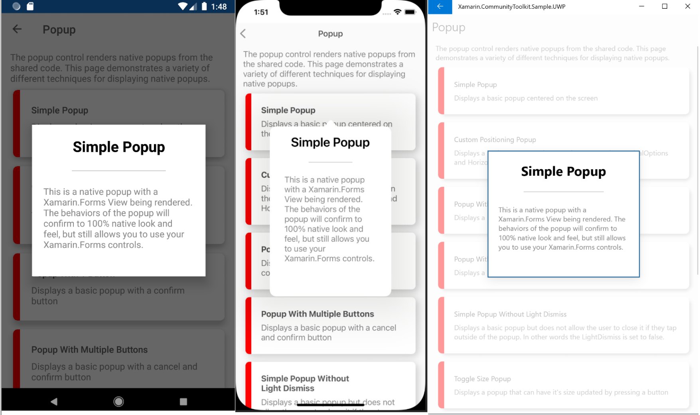

# Xamarin Community Toolkit Popup

The `Popup` control allows developers to create and display popups within their applications. The `Popup` can be extended to return data to the invocation code. There are 2 main classes for a developer to use based on what they wish to achieve:

1. `Popup` - this will render the custom UI and return an `object` if a return result is required.
1. `Popup<T>` - this behaves as `Popup` but allows a generic result to be returned.

## Syntax

A Popup can be used just like a `ContentView` or `ContentPage` is used, below are some basic examples of using a popup in XAML and C#.

### Creating a simple `Popup`

#### XAML

```xml
<xct:Popup xmlns="http://xamarin.com/schemas/2014/forms"
           xmlns:x="http://schemas.microsoft.com/winfx/2009/xaml"
           xmlns:xct="clr-namespace:Xamarin.CommunityToolkit.UI.Views;assembly=Xamarin.CommunityToolkit"
           x:Class="MyProject.SimplePopup">

    <StackLayout>
        <Label Text="Hello Simple Popup" />
    </StackLayout>
    
</xct:Popup>
```

#### C#

```csharp
using Xamarin.CommunityToolkit.UI.Views;

var popup = new Popup
{
    Content = new StackLayout
    {
        Children = 
        {
            new Label
            {
                Text = "Hello Simple Popup"
            }
        }
    }
};
```

### Showing the Popup

With the Popup defined it can be displayed by using the `INavigation` extension methods also provided by the toolkit located under the namespace `Xamarin.CommunityToolkit.Extensions`. At the most basic level you can access this on any `ContentPage` in Xamarin.Forms via the following code:

```csharp
using Xamarin.CommunityToolkit.Extensions;

App.Current.MainPage.Navigation.ShowPopup(popup);
```

#### Event handling

Popups can use the event handlers to determine if a Popup has opened or been dismissed. The code below will print a message to the console once the Popup has been dismissed.

```csharp
popup.Dismissed += (s, e) => Console.WriteLine("Popup Dismissed");
App.Current.MainPage.Navigation.ShowPopup(popup);
```

#### Await the Popup to be dismissed

Popups also support async/await Task. The code below functions the same way as above but without events.

```csharp
await App.Current.MainPage.Navigation.ShowPopupAsync(popup);
Console.WriteLine("Popup Dismissed");
```

### Returning a result

We can further enhance a Popup to return a result. This example involves adding a button that will invoke the `Dismiss` method and pass in a specific value. We also make use of the `Popup<T>` class here.

#### XAML

```xml
<xct:Popup xmlns="http://xamarin.com/schemas/2014/forms"
           xmlns:x="http://schemas.microsoft.com/winfx/2009/xaml"
           xmlns:xct="clr-namespace:Xamarin.CommunityToolkit.UI.Views;assembly=Xamarin.CommunityToolkit"
           x:Class="MyProject.SimplePopup"
           x:TypeArguments="string">

    <StackLayout>
        <Label Text="Hello Simple Popup" />
        <Button Text="Dismiss"
                Clicked="Button_Clicked" />
    </StackLayout>
    
</xct:Popup>
```

And the associated click event handler:

```csharp
void Button_Clicked(object sender, EventArgs args)
{
    Dismiss("Dismiss was clicked");
}
```

#### C#

```csharp
var popup = new Popup<string>
{
    Content = new StackLayout
    {
        Children = 
        {
            new Label
            {
                Text = "Hello Simple Popup"
            },
            new Button
            {
                Text = "Dismiss",
                Command = new Command(() => Dismiss("Dismiss was clicked"))
            }
        }
    }
};
```

#### Awaiting a result

To take the example above a step further we can also await for a result to be returned from the Popup to the calling code:

```csharp
var result = await App.Current.MainPage.Navigation.ShowPopupAsync(popup);
Console.WriteLine(result);
```

## Properties

| Property | Type | Description |
| -- | -- | -- |
| Anchor | [`View`](xref:Xamarin.Forms.View) | Gets or sets the `View` anchor. The Anchor is where the Popup will render closest to. When an Anchor is configured the popup will appear centered over that control or as close as possible. |
| Color | [`Color`](xref:Xamarin.Forms.Color) | Gets or sets the `Color` of the `Popup`. This color sets the native background color of the `Popup`, which is independent of any background color configured in the actual View. |
| Content | [`View`](xref:Xamarin.Forms.View) | Gets or sets the `View` content to render in the Popup. The View can be of type: `View`, `ContentPage` or `NavigationPage` |
| HorizontalOptions | [`LayoutOptions`](xref:Xamarin.Forms.LayoutOptions) | Gets or sets the `LayoutOptions` for positioning the `Popup` horizontally on the screen. |
| IsLightDismissEnabled | `bool` | Gets or sets a value indicating whether the popup can be light dismissed. When `true` and the user taps outside of the popup it will dismiss. On Android - when `false` the hardware back button is disabled. |
| Result | `Task<T>` | Gets the final result of the dismissed popup. |
| Size | [`Size`](xref:Xamarin.Forms.Size) | Gets or sets the `Size` of the Popup Display. The Popup will always try to constrain the actual size of the `Popup` to the `Popup` of the View unless a `Size` is specified. If the `Popup` contains `LayoutOptions` a `Size` will be required. This will allow the View to have a concept of `Size` that varies from the actual `Size` of the `Popup` |
| VerticalOptions | [`LayoutOptions`](xref:Xamarin.Forms.LayoutOptions) | Gets or sets the `LayoutOptions` for positioning the `Popup` vertically on the screen. |

## Methods

| Methods | Return Type | Description |
| -- | -- | -- |
| Dismiss(T) | void | Dismiss the current `Popup`. The parameter passed in will be the Result returned. |
| Reset() | void | Resets the `Popup` so that another Result can be returned. |

## Events

| Events | Description |
| -- | -- |
| Dismissed | Dismissed event is invoked when the popup is closed. |
| Opened | Opened event is invoked when the popup is opened. |

## Examples

Below are a series of screenshots from the sample app that demonstrate some of the different features of the Popup Control along with a link to it's use within the samples app.

### Simple Popup



Sample links:

- [SimplePopup.xaml](https://github.com/xamarin/XamarinCommunityToolkit/blob/main/samples/XCT.Sample/Pages/Views/Popups/SimplePopup.xaml)
- [SimplePopup.xaml.cs](https://github.com/xamarin/XamarinCommunityToolkit/blob/main/samples/XCT.Sample/Pages/Views/Popups/SimplePopup.xaml.cs)

### Custom Positioning Popup

You can position a popup anywhere on the screen, the screenshot below shows that the popup is positioned horizontally left and vertically center.


Sample links:

- [PopupPositionPage.xaml](https://github.com/xamarin/XamarinCommunityToolkit/blob/main/samples/XCT.Sample/Pages/Views/Popups/PopupPositionPage.xaml)
- [PopupPositionPage.xaml.cs](https://github.com/xamarin/XamarinCommunityToolkit/blob/main/samples/XCT.Sample/Pages/Views/Popups/PopupPositionPage.xaml.cs)

## Sample project

[Popup sample page(s) Source](https://github.com/xamarin/XamarinCommunityToolkit/tree/main/samples/XCT.Sample/Pages/Views/Popups)

You can see this in action in the [Xamarin Community Toolkit Sample App](https://github.com/xamarin/XamarinCommunityToolkit).

## API

* [Popup source code](https://github.com/xamarin/XamarinCommunityToolkit/tree/main/src/CommunityToolkit/Xamarin.CommunityToolkit/Views/Popup)

