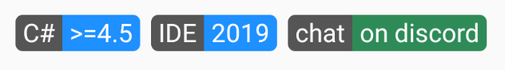

# Xamarin Community Toolkit Shield

The Shield is a type of badge that has two colored sections that contain text:



## Syntax

```xaml
<ContentPage xmlns="http://xamarin.com/schemas/2014/forms"
             xmlns:x="http://schemas.microsoft.com/winfx/2009/xaml"
             xmlns:xct="http://xamarin.com/schemas/2020/toolkit"
             x:Class="MyLittleApp.MainPage">

     <StackLayout>

        <xct:Shield
                Subject="chat"
                Status="on discord"
                StatusBackgroundColor="SeaGreen"
                StatusTextColor="White"
                Margin="2,0" />

    </StackLayout>

</ContentPage>
```

## Properties

|Property  |Type  |Description  |
|---------|---------|---------|
| Command | [`ICommand`](xref:System.Windows.Input.ICommand) | Gets or sets a `Command` that is invoked when the `Shield` is tapped. This is a bindable property. |
| CommandParameter | object | Gets or sets an object that is used as a parameter value for the invoked `Command` when the `Shield` is tapped. This is a bindable property. |
| FontAttributes | [`FontAttributes`](xref:Xamarin.Forms.FontAttributes) | Gets or sets the font attributes to be used for the text of the `Shield`. This is a bindable property. |
| FontFamily | double | Gets or sets the font family for the text of the `Shield`. This is a bindable property. |
| FontSize | double | Gets or sets the font size for the text of the `Shield`. [`NamedSize`](xref:Xamarin.Forms.NamedSize) values can be used. This is a bindable property. |
| Status | string | Gets or sets the text for the right (`Status`) part of the `Shield`. This is a bindable property. |
| StatusBackgroundColor | [`Color`](xref:Xamarin.Forms.Color) | Gets or sets the color for the right (`Status`) part of the `Shield`. This is a bindable property. |
| StatusTextColor | [`Color`](xref:Xamarin.Forms.Color) | Gets or sets the text color for the right (`Status`) part of the `Shield`. This is a bindable property. |
| Subject | string | Gets or sets the text for the left (`Subject`) part of the `Shield`. This is a bindable property. |
| SubjectBackgroundColor | [`Color`](xref:Xamarin.Forms.Color) | Gets or sets the color for the left (`Subject`) part of the `Shield`. This is a bindable property. |
| SubjectTextColor | [`Color`](xref:Xamarin.Forms.Color) | Gets or sets the text color for the left (`Subject`) part of the `Shield`. This is a bindable property. |

> [!NOTE]
> `TextColor` is deprecated since v1.1. Please use `StatusTextColor` instead.
> `Color` is deprecated since v1.1. Please use `StatusBackgroundColor` instead"

## Events

| Event  |Type  |Description  |
|---------|---------|---------|
| Tapped | EventHandler | Occurs when the `Shield` is tapped. |

## Sample

[Shield sample page Source](https://github.com/xamarin/XamarinCommunityToolkit/blob/main/samples/XCT.Sample/Pages/Views/ShieldPage.xaml)

You can see this in action in the [Xamarin Community Toolkit Sample App](https://github.com/xamarin/XamarinCommunityToolkit).

## API

* [Shield source code](https://github.com/xamarin/XamarinCommunityToolkit/blob/main/src/CommunityToolkit/Xamarin.CommunityToolkit/Views/Shield.shared.cs)
