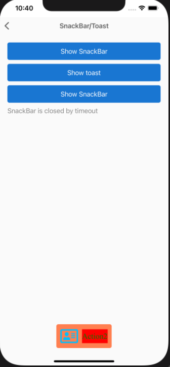
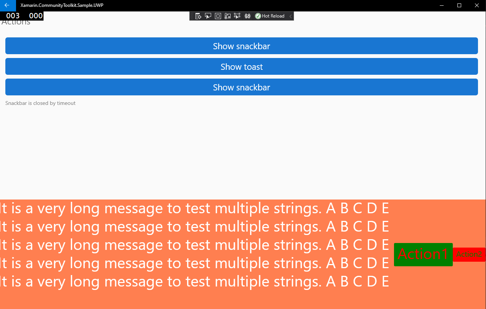

# Xamarin Community Toolkit Toast/Snackbar

## Toast ##

A toast provides simple feedback about an operation in a small popup.

There are 2 different ways to use Toast.

1. The simple - on your MyVisualElement call the method:
```csharp	
await MyVisualElement.DisplayToastAsync(message, duration);	
```	
where `message` is your text, and `duration` is the timespan of toast (an optional parameter). Default duration = 3000 milliseconds;	


1. With advanced settings you can customise Message options and Toast options:	
```csharp	
    var messageOptions = new MessageOptions	
    {	
        Foreground = Color.Black,	
        Font = Font.SystemFontOfSize(16),
        Message = "My text",
        Padding = new Thickness(10, 10, 10, 10),
    };	
    var options = new ToastOptions	
    {	
        MessageOptions = messageOptions,	
        Duration = TimeSpan.FromMilliseconds(3000),	
        BackgroundColor = Color.Default,
        CornerRadius = new Thickness(10, 10, 10, 10),
        IsRtl = false
    };	
    await this.DisplayToastAsync(options);	
```	


## Snackbar ##

Snackbars inform users of a process that an app has performed or will perform. They appear temporarily, towards the bottom of the screen

Snackbar has API which is similar to the Toast.	

1. Simple execution with predefined settings. On your Page call the method: 	
```csharp	
var result = await MyVisualElement.DisplaySnackbarAsync(message, actionButtonText, action, duration);	
```	
where `message` is your text, `actionButtonText` is the text for the button, `action` is a `Func<Task>` and `duration` is optional parameter. Default duration = 3000 milliseconds;

The result is `Boolean`. `True` - if Snackbar is closed by the user. `False` - if Snackbar is closed by timeout.



1. With advanced settings you have a full control for all `MessageOptions`, `SnackBarActionOptions` and `SnackBarOptions`:
```csharp	
    var messageOptions = new MessageOptions	
    {	
        Foreground = Color.Black,	
        Font = Font.SystemFontOfSize(16),
        Padding = new Thickness(10, 10, 10, 10),
        Message = "My text"	
    };	
    var actionOptions = new List<SnackBarActionOptions>	
    {	
        new SnackBarActionOptions	
        {	
            ForegroundColor = Color.Black,	
            BackgroundColor = Color.White,	
            FontFamily = Font.SystemFontOfSize(14),	
            Padding = new Thickness(10, 10, 10, 10),
            Text = "Action 1",	
            Action = () => // null by default	
            {	
                Debug.WriteLine("1");	
                return Task.CompletedTask;	
            }	
        },
        new SnackBarActionOptions	
        {	
            ForegroundColor = Color.Black,	
            BackgroundColor = Color.White,	
            FontFamily = Font.SystemFontOfSize(16),
            Padding = new Thickness(0, 0, 0, 0),
            Text = "Action 2",	
            Action = () => // null by default	
            {	
                Debug.WriteLine("1");	
                return Task.CompletedTask;	
            }	
        }	
    };	
    var options = new SnackbarOptions	
    {	
        MessageOptions = messageOptions,	
        Duration = TimeSpan.FromMilliseconds(3000),
        BackgroundColor = Color.Default,	        
        CornerRadius = new Thickness(10, 10, 10, 10),
        IsRtl = false,	
        Actions = actionOptions	
    };	
    var result = await this.DisplaySnackbarAsync(options);	
```



## Details of implementation and limitation for different platforms ##

### I ###
Both Toast and Snackbar work on all platforms: Android, iOS, macOS, UWP, WPF, GTK, Tizen.

### II ###
Both Toast and Snackbar by default use native colors and automatically change them depends on the system theme.

### III ###
"Native" Toast and Snackbar available only on Android and created by Google.

Other platforms use "Container" (UIView for iOS, NSView for macOS, Grid for WPF, HBox for GTK, Dialog foe Tizen) to display a message and action buttons.

Because of Android limitations, it has only 1 action button, while all other platforms can display multiple action buttons.

### IV ###
Android uses snackbar for both `DisplayToastAsync` and `DisplaySnackbarAsync`. The difference that `DisplayToastAsync` hides the action button.

## API

* [Toast/Snackbar Source code](https://github.com/xamarin/XamarinCommunityToolkit/tree/main/src/CommunityToolkit/Xamarin.CommunityToolkit/Views/Snackbar)
* [VisualElementExtension Source code](https://github.com/xamarin/XamarinCommunityToolkit/blob/main/src/CommunityToolkit/Xamarin.CommunityToolkit/Extensions/VisualElement/VisualElementExtension.shared.cs)
