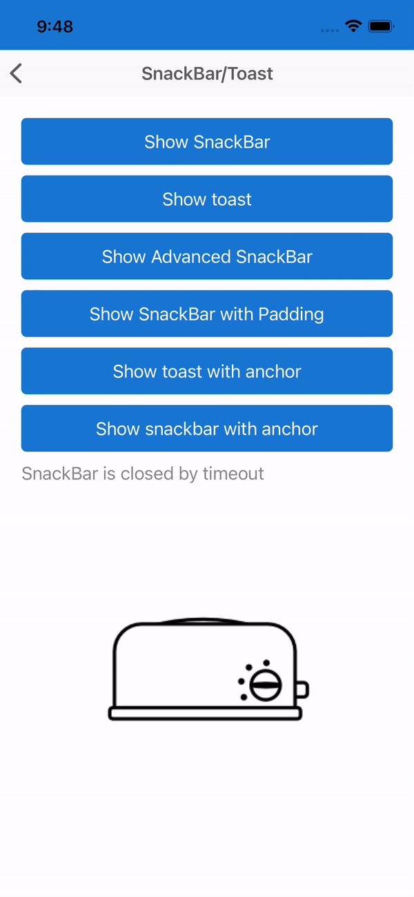
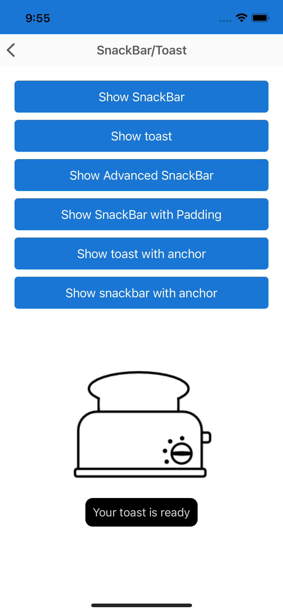

# Xamarin Community Toolkit Toast/Snackbar

The toolkit offers 2 main ways of presenting a small notification, these are:

## 1. Toast ##

A toast provides simple feedback about an operation in a small popup. It only fills the amount of space required for the message and the current activity remains visible and interactive. Toasts automatically disappear after a timeout.

A Toast will by default use native colors and automatically change them depending on the system theme.

Toast notifications can be displayed through the use of the `DisplayToastAsync` extension method. This can be called on any `VisualElement`. There are 2 overloads for this method and can be used as described below:

### 1. Simple
The first overload allows 
|Parameter  |Type  |Description  |
|---------|---------|---------|
| `message` | `string` | The message to be displayed   |
| `duration` | `int` | The number of milliseconds message will be displayed (default is 3000ms) |

This will implementation will make use of all styling defaults.

#### Example

Assuming there is a `VisualElement` defined in our application called `MyVisualElement` then the following can be used to show a Toast message.

```csharp	
await MyVisualElement.DisplayToastAsync("Your toast is ready");	
```	



### 2. Advanced

The second overload allows for advanced options to be supplied so that you can customise the layout and styling of the Toast message.

#### Example

```csharp	
var messageOptions = new MessageOptions
{
    Foreground = Color.LightGray,
    Font = Font.SystemFontOfSize(16),
    Message = "Your toast is ready",
    Padding = new Thickness(10, 10, 10, 10),
};
var options = new ToastOptions
{
    MessageOptions = messageOptions,
    Duration = TimeSpan.FromMilliseconds(3000),
    BackgroundColor = Color.Black,
    CornerRadius = new Thickness(10, 10, 10, 10),
    IsRtl = false
};

await this.DisplayToastAsync(options);	
```	



## 2. Snackbar ##

Snackbars inform users of a process that an app has performed or will perform. They appear temporarily, towards the bottom of the screen.

A Snacker will by default use native colors and automatically change them depending on the system theme.

A Snackbar can be presented very similarly to a Toast. Snackbar notifications can be displayed through the use of the `DisplaySnackbarAsync` extension method. This can be called on any `VisualElement`.

`DisplaySnackbarAsync` will return `True` if the Snackbar is closed by the user or `False` if the Snackbar is closed by timeout.

There are 2 overloads for this method and can be used as described below:

### 1. Simple
The first overload allows:
|Parameter  |Type  |Description  |
|---------|---------|---------|
| `message` | `string` | The message to be displayed   |
| `actionButtonText` | `string` | The text on the button   |
| `action` | `Func<Task>` | The action to perform when the button is tapped   |
| `duration` | `int` | The number of milliseconds message will be displayed (default is 3000ms) |

This will implementation will make use of all styling defaults.

#### Example

Assuming there is a `VisualElement` defined in our application called `MyVisualElement` then the following can be used to show a Toast message.

```csharp	
var result = await MyVisualElement.DisplaySnackbarAsync(message, actionButtonText, action, duration);	
```	


### 2. Advanced
The second overload allows for advanced options to be supplied so that you can customise the layout and styling of the Snackbar message.

### Example

```csharp	
var messageOptions = new MessageOptions	
{	
    Foreground = Color.Black,	
    Font = Font.SystemFontOfSize(16),
    Padding = new Thickness(10, 10, 10, 10),
    Message = "My text"	
};	
var actionOptions = new List<SnackBarActionOptions>	
{	
    new SnackBarActionOptions	
    {	
        ForegroundColor = Color.Black,	
        BackgroundColor = Color.White,	
        FontFamily = Font.SystemFontOfSize(14),	
        Padding = new Thickness(10, 10, 10, 10),
        Text = "Action 1",	
        Action = () => // null by default	
        {	
            Debug.WriteLine("1");	
            return Task.CompletedTask;	
        }	
    },
    new SnackBarActionOptions	
    {	
        ForegroundColor = Color.Black,	
        BackgroundColor = Color.White,	
        FontFamily = Font.SystemFontOfSize(16),
        Padding = new Thickness(0, 0, 0, 0),
        Text = "Action 2",	
        Action = () => // null by default	
        {	
            Debug.WriteLine("1");	
            return Task.CompletedTask;	
        }	
    }	
};	
var options = new SnackbarOptions	
{	
    MessageOptions = messageOptions,	
    Duration = TimeSpan.FromMilliseconds(3000),
    BackgroundColor = Color.Default,	        
    CornerRadius = new Thickness(10, 10, 10, 10),
    IsRtl = false,	
    Actions = actionOptions	
};	

var result = await this.DisplaySnackbarAsync(options);	
```


## Supported platforms

|Platform |Supported?  |
|---------|---------|
| Android | Yes |
| iOS     | Yes |
| macOS   | Yes |
| UWP     | Yes |
| WPF     | Yes |
| GTK     | Yes |
| Tizen   | Yes |

## Platform differences
Toast and Snackbar are concepts built by Google which is the only operating system to natively supported them. The Xamarin Community Toolkit makes use of this native support on Android.

All other platforms use "Container" (UIView for iOS, NSView for macOS, Grid for WPF, HBox for GTK, Dialog foe Tizen) to display a message and action buttons.

The Android Snackbar is limited to only showing 1 action button, while all other platforms can display multiple action buttons.

## API

* [Toast/Snackbar Source code](https://github.com/xamarin/XamarinCommunityToolkit/tree/main/src/CommunityToolkit/Xamarin.CommunityToolkit/Views/Snackbar)
* [VisualElementExtension Source code](https://github.com/xamarin/XamarinCommunityToolkit/blob/main/src/CommunityToolkit/Xamarin.CommunityToolkit/Extensions/VisualElement/VisualElementExtension.shared.cs)
