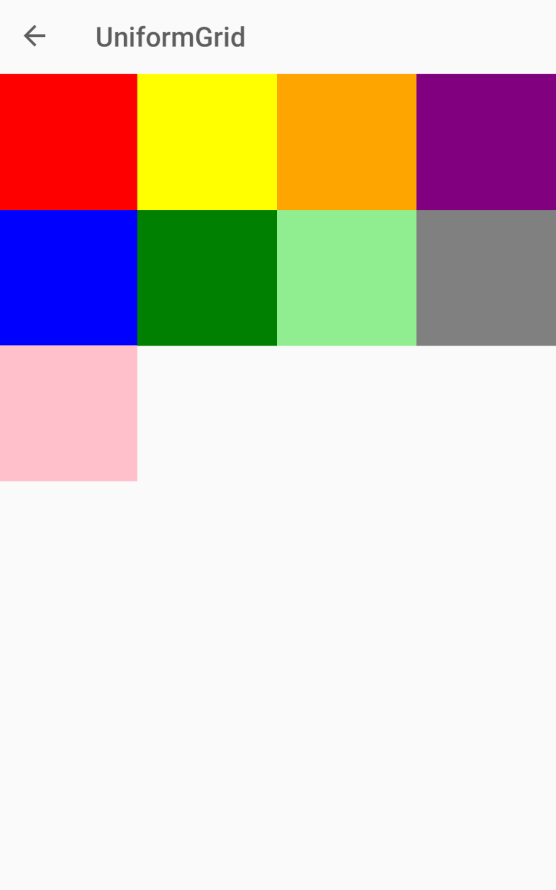

# Xamarin Community Toolkit UniformGrid

The `UniformGrid` is like the [`Grid`](xref:Xamarin.Forms.Grid), with the possibility of multiple rows and columns, but with one important difference: all rows and columns have the same size. That size is determined by the largest width and height of all the child elements. The child element with the largest width does not necessarily have to be the child element with the largest height.

Use the `UniformGrid` when you need the `Grid` behavior without the need to specify different sizes for the rows and columns.

[](uniformgrid-images/uniformgrid-example.png#lightbox)

## Syntax

```xaml
<ContentPage xmlns="http://xamarin.com/schemas/2014/forms"
             xmlns:x="http://schemas.microsoft.com/winfx/2009/xaml"
             xmlns:xct="http://xamarin.com/schemas/2020/toolkit"
             x:Class="MyLittleApp.MainPage">

     <StackLayout>

    <xct:UniformGrid>
        <BoxView Color="Red" />
        <BoxView Color="Yellow" />
        <BoxView Color="Orange" />
        <BoxView Color="Purple" />
        <BoxView Color="Blue" />
        <BoxView Color="Green" />
        <BoxView Color="LightGreen" />
        <BoxView Color="Gray" />
        <BoxView Color="Pink" />
    </xct:UniformGrid>

    </StackLayout>

</ContentPage>
```

## Sample

[UniformGrid sample page Source](https://github.com/xamarin/XamarinCommunityToolkit/blob/main/samples/XCT.Sample/Pages/Views/UniformGridPage.xaml)

You can see this in action in the [Xamarin Community Toolkit Sample App](https://github.com/xamarin/XamarinCommunityToolkit).

## API

* [UniformGrid source code](https://github.com/xamarin/XamarinCommunityToolkit/blob/main/src/CommunityToolkit/Xamarin.CommunityToolkit/Views/UniformGrid.shared.cs)
